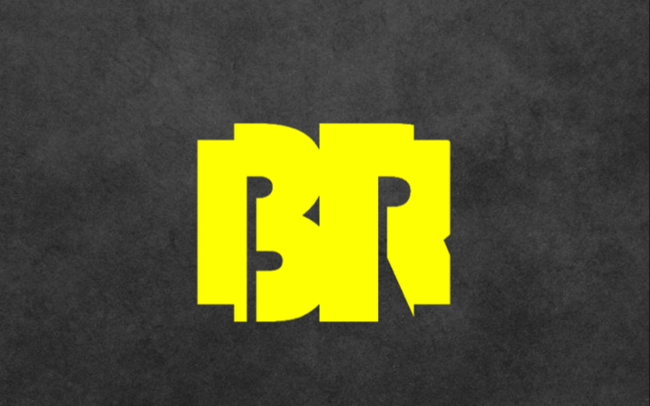

# BracketRunner

<a href='http://zuhairshaikh.me/BracketRunner-DemoPage'></a>

[Link to Demo Page](http://zuhairshaikh.me/BracketRunner-DemoPage)

**Gif/Image**

## Background

One thing all of us share is a passion for competitive gaming. This ranges from Esports to Trading Card Games. Nick, having a background in playing, acting as a judge and organizing tournaments for Magic: The Gathering, and myself (Zach), having experience as a ranked competitor in the Northern California Super Smash Bros for WiiU community, came up with the idea for this application independently. Zuhair, being a League of Legends Esports enthusiast, and Ali, being an Esport enthusiast for the Super Smash Brothers series, were both talented programmers who shared Nick and my passion.

We felt that the current tournament bracket applications used for running tournaments were missing certain user-centric features. Our goal was to develop a game agnostic tournament bracket runner which assisted Tournament Organizers in running their tournaments, enhanced participant's experience competing in a given bracket, and gave spectators an enriched experience following a bracket. Currently the app is at its foundation, upon which we look forward to adding more of the other unique features, such as following users and bracket push notifications.

## Technologies

BracketRunner is developed primarily using the MERN stack which is made up of the following technologies:

- MongoDB for non-relational data management.
- Express.js to handle server-side routing and middleware functionality.
- React-Native for composing mobile UI.
- Node.js as a JavaScript runtime for web development.

Beyond these we used:

- Mongoose.js for MongoDB object modeling.
- Robo 3T w/ Postman to test api calls and data preservation.
- mLab for MongoDB database hosting.
- appetize.io for emulating mobile functionality in browser.

## Features

### Zach Greathouse

#### Navigating mobile

Learning navigation for a mobile app was challenging. With web applications, navigation is simply based on parsing the url and moving through a 'path'. Of course with mobile applications there is no url to parse. We needed to find a React-Native module to assist us in breaking up components into pages and modals. Finding a good navigation module was a challenge, as there are very many deprecated or OS specific modules we needed to sift through. We ended up going with React Navigation, as it is not OS specific and holds its own state to allow one to pass props through navigation to navigate to specific pages. For example: navigating from a bracket feed to a bracket detail of a specific bracket. Below is a snippet from the router where we built the bracket feed stack, and a couple of snippets from the bracket feed component where we implemented said navigation.

```javascript
// app/components/config/router.js
export const BracketStack = StackNavigator({
  BracketFeed: {
    screen: BracketFeed,
    navigationOptions: {
      // title: 'Bracket Feed'
    }
  },
  BracketDetail: {
    screen: BracketDetailStack,
    navigationOptions: {
      // title: 'Bracket Detail'
    }
  },
  ResultForm: {
    screen: ResultForm,
    navigationOptions: {
      // title: 'Edit Results'
    }
  }
});
```

```javascript
// app/components/bracket/bracket_feed.js

onLearnMore(bracket) {
  this.props.navigation.navigate('BracketDetail', { bracket });
}
```

```javascript
// app/components/bracket/bracket_feed.js (render function)
const allLiveBrackets = liveBrackets.map((bracket, idx) => {
  return (
    <View key={`bracket-${idx}`} bracket={ bracket }>
      <TouchableOpacity style={styles.bracketButton} onPress={() => this.onLearnMore(bracket)}>
        <Text style={styles.bracketTitle}>{bracket.title}</Text>
        <View style={styles.timeContainer}>
          <Text style={styles.gameText}>{bracket.game}</Text>
          {this.tourneyStream()}
          <Text style={styles.live}>{this.isLive()}</Text>
        </View>
      </TouchableOpacity>
    </View>
  )

});
```


### Nick Whitson

#### This isn't even our final form

The funniest bug that we encountered had to do with an update to Redux Form. This handy node package comes with a suite of methods, has its own reducer, and makes creating forms easy. However whenever we would use our form to create a new bracket we would get locked out of signing in as that user.

After extensive bug hunting in our User Authentication form we found that Redux Forms were not clearing their fields after being submitted. We also discovered what we thought were many small forms were really one big connected form. Therefore whenever we send a form to create a bracket we were also sending the database an existing user with an unhashed password. We fixed this by chaining a promise to the end of the dispatch request which cleared the form.

```javascript
this.props.createBracket(bracket)
.then((response) => {
  let bracket = response.data;
  this.props.navigation.navigate('BracketDetail', { bracket });
})
.then(() => {
  this.props.reset();
})

```

### Zuhair Shaikh

#### Waiting on a Promise

One of the features that we really wanted was for the app to automatically realize when a registered user was entered as a player in a tournament bracket. Doing so would allow us to have easy access to related information, such as their profile image, on the frontend.

This of course involves checking whether the user with the supplied username exists in the database. The problem arises when you are trying to make those asynchronous checks for all entrants before creating the required bracket.

While not the most elegant solution, the one I implemented involved collecting all those queries in an array and using `Promise.all` to wait for them to complete before setting them up as needed.

```javascript
// server/controllers/brackets_controller.js

Promise.all(userQueries(bracketProps.entrants))
  .then(users => {

    // Setup entrants to be used on the frontend
    bracketProps.entrants = {};
    users.forEach((user) => {
    bracketProps.entrants[user.username] = user;
  });

  // Finally create the bracket
  Bracket.create(bracketProps)
    .then(bracket => res.send(bracket))
    .catch(next);
  });
```

```javascript
// server/controllers/brackets_controller.js

const userQueries = entrants => {
  const promiseArr = [];

  for (let i = 0; i <= Object.keys(entrants).length; i++) {

    // Collect the queries then create respective user objects
    promiseArr.push(
      User.findOne({ username: entrants[i] }).then(
        user => (entrants[entrants[i]] = user ? user : { /* dummy user object */ })
      )
    );
  }
  return promiseArr;
};
```

###### Note: MongoDB queries are not actually promises. Mongoose.js, which acts as a wrapper for MongoDB, provides queries that have promise like properties. Which is why we can chain `.then`'s onto them and have them work the way we expect.

## Looking forward

There are a couple things we planned to develop that would set BracketRunner apart from what is out there.

- [ ] Receive Push Notifications for when a tournament, match or player starts/stops playing.
- [ ] Allow creation of multiple types of bracket.
- [ ] Get BracketRunner listed on App Store.


## Developers

#### Zach Greathouse

[Github](https://github.com/zgreathouse) | [LinkedIn](https://www.linkedin.com/in/zachary-greathouse-11345813b/)

#### Nick Whitson

[Github](https://github.com/newhitson) |
[LinkedIn](https://www.linkedin.com/in/newhitson/)

#### Ali Haq

[Github](https://github.com/alimhaq) | [LinkedIn](https://www.linkedin.com/in/ali-haq-85825821)

#### Zuhair Shaikh

[Github](https://github.com/ZuhairS) | [LinkedIn](https://www.linkedin.com/in/zuhairshaikh/)
